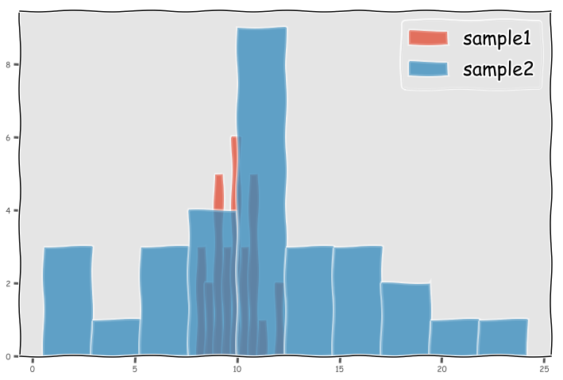
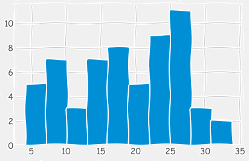
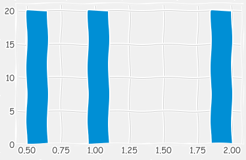
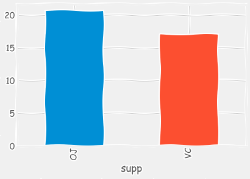
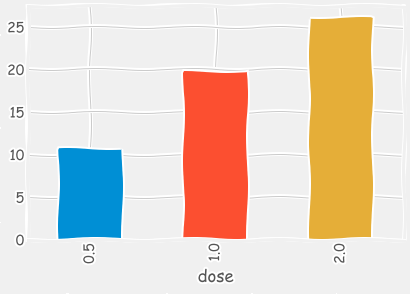

## Welch's T-Test


```python
import numpy as np
```


```python
sample1 = np.random.normal(loc = 10, scale = 1, size = 30)
#sample1
```


```python
sample2 = np.random.normal(loc = 10.5, scale = 5, size = 30)
```


```python
import matplotlib.pyplot as plt
plt.style.use('ggplot')
plt.xkcd();
```


```python
fig = plt.figure(figsize = (12, 8))
plt.hist(sample1, label = 'sample1', alpha = 0.5)
plt.hist(sample2, label = 'sample2', alpha = 0.5)
plt.legend(fontsize = 24);
```





```python
sample1.mean(), sample2.mean()
```


    (9.845497975073025, 11.382377160458269)


```python
sample1.std(), sample2.std()
```


    (1.0452784981235455, 5.28595425741003)


```python
from scipy import stats
```


```python
stats.ttest_ind(sample1, sample2, equal_var=False)
```


    Ttest_indResult(statistic=-1.535981175647268, pvalue=0.13460246431051126)


## Multiple Comparison Problem 


```python
alpha = 0.05
1 - ((1-0.05) **5)
```


    0.22621906250000023


```python

```


```python

```

# ANOVA  - Lab

## Introduction

In this lab, you'll get some brief practice generating an ANOVA table (AOV) and interpreting its output. You'll then also perform some investigations to compare the method to the t-tests you previously employed to conduct hypothesis testing.

## Objectives

You will be able to:
* Use ANOVA for testing multiple pairwise comparisons
* Understand and explain the methodology behind ANOVA tests

## Loading the Data

Start by loading in the data stored in the file **ToothGrowth.csv**.


```python
ls
```

    CONTRIBUTING.md  README.md        index.ipynb
    LICENSE.md       ToothGrowth.csv


```python
# Your code here
import pandas as pd
df = pd.read_csv('ToothGrowth.csv')
```


```python
df.head()
```


<div>
<style scoped>
    .dataframe tbody tr th:only-of-type {
        vertical-align: middle;
    }

    .dataframe tbody tr th {
        vertical-align: top;
    }

    .dataframe thead th {
        text-align: right;
    }
</style>
<table border="1" class="dataframe">
  <thead>
    <tr style="text-align: right;">
      <th></th>
      <th>len</th>
      <th>supp</th>
      <th>dose</th>
    </tr>
  </thead>
  <tbody>
    <tr>
      <th>0</th>
      <td>4.2</td>
      <td>VC</td>
      <td>0.5</td>
    </tr>
    <tr>
      <th>1</th>
      <td>11.5</td>
      <td>VC</td>
      <td>0.5</td>
    </tr>
    <tr>
      <th>2</th>
      <td>7.3</td>
      <td>VC</td>
      <td>0.5</td>
    </tr>
    <tr>
      <th>3</th>
      <td>5.8</td>
      <td>VC</td>
      <td>0.5</td>
    </tr>
    <tr>
      <th>4</th>
      <td>6.4</td>
      <td>VC</td>
      <td>0.5</td>
    </tr>
  </tbody>
</table>
</div>


```python
df.describe()
```


<div>
<style scoped>
    .dataframe tbody tr th:only-of-type {
        vertical-align: middle;
    }

    .dataframe tbody tr th {
        vertical-align: top;
    }

    .dataframe thead th {
        text-align: right;
    }
</style>
<table border="1" class="dataframe">
  <thead>
    <tr style="text-align: right;">
      <th></th>
      <th>len</th>
      <th>dose</th>
    </tr>
  </thead>
  <tbody>
    <tr>
      <th>count</th>
      <td>60.000000</td>
      <td>60.000000</td>
    </tr>
    <tr>
      <th>mean</th>
      <td>18.813333</td>
      <td>1.166667</td>
    </tr>
    <tr>
      <th>std</th>
      <td>7.649315</td>
      <td>0.628872</td>
    </tr>
    <tr>
      <th>min</th>
      <td>4.200000</td>
      <td>0.500000</td>
    </tr>
    <tr>
      <th>25%</th>
      <td>13.075000</td>
      <td>0.500000</td>
    </tr>
    <tr>
      <th>50%</th>
      <td>19.250000</td>
      <td>1.000000</td>
    </tr>
    <tr>
      <th>75%</th>
      <td>25.275000</td>
      <td>2.000000</td>
    </tr>
    <tr>
      <th>max</th>
      <td>33.900000</td>
      <td>2.000000</td>
    </tr>
  </tbody>
</table>
</div>


```python
import matplotlib.pyplot as plt
plt.style.use('fivethirtyeight')
```


```python
df['len'].hist()
```


    <matplotlib.axes._subplots.AxesSubplot at 0x1a20f12d68>





```python
df['dose'].hist()
```


    <matplotlib.axes._subplots.AxesSubplot at 0x1a20f6f470>





```python
df.groupby('supp')['len'].mean().plot(kind = 'bar')
```


    <matplotlib.axes._subplots.AxesSubplot at 0x1a21082be0>





```python
df.groupby('dose')['len'].mean().plot(kind = 'bar')
```


    <matplotlib.axes._subplots.AxesSubplot at 0x1a21156ac8>





## Generating the ANOVA Table

Now generate an ANOVA table in order to analyze the influence of the medication and dosage 


```python
#Your code here
import statsmodels.api as sm
from statsmodels.formula.api import ols
```


```python
formula = 'len ~ C(supp) + C(dose)'
lm = ols(formula, df).fit()
table = sm.stats.anova_lm(lm, typ = 2)
print(table)
```

                   sum_sq    df          F        PR(>F)
    C(supp)    205.350000   1.0  14.016638  4.292793e-04
    C(dose)   2426.434333   2.0  82.810935  1.871163e-17
    Residual   820.425000  56.0        NaN           NaN


## Reading the Table

Make a brief comment regarding the statistics regarding the effect of supplement and dosage on tooth length.


```python
# Your comment here
```

## Comparing to T-Tests

Now that you've gotten a brief chance to interact with ANOVA, its interesting to compare the results to those from the t-tests you were just working with. With that, start by breaking the data into two samples: those given the OJ supplement, and those given the VC supplement. Afterwards, you'll conduct a t-test to compare the tooth length of these two different samples.


```python
#Your code here
df.head(2)
```


<div>
<style scoped>
    .dataframe tbody tr th:only-of-type {
        vertical-align: middle;
    }

    .dataframe tbody tr th {
        vertical-align: top;
    }

    .dataframe thead th {
        text-align: right;
    }
</style>
<table border="1" class="dataframe">
  <thead>
    <tr style="text-align: right;">
      <th></th>
      <th>len</th>
      <th>supp</th>
      <th>dose</th>
    </tr>
  </thead>
  <tbody>
    <tr>
      <th>0</th>
      <td>4.2</td>
      <td>VC</td>
      <td>0.5</td>
    </tr>
    <tr>
      <th>1</th>
      <td>11.5</td>
      <td>VC</td>
      <td>0.5</td>
    </tr>
  </tbody>
</table>
</div>


```python
df_oj = df[df['supp'] == 'OJ']
df_vc = df[df['supp'] == 'VC']
```

Now compare a t-test between these two groups and print the associated two-sided p-value.


```python
#Your code here; calculate the 2-sided p-value for a t-test comparing the two supplement groups.
from scipy import stats
```


```python
df_oj['len'].std(), df_vc['len'].std()
```


    (6.605561049722362, 8.266028664664638)


```python
stats.ttest_ind(df_oj['len'], df_vc['len'], equal_var=False)
```


    Ttest_indResult(statistic=1.91526826869527, pvalue=0.06063450788093387)


## A 2-Category ANOVA F-Test is Equivalent to a 2-Tailed t-Test!

Now, recalculate an ANOVA F-test with only the supplement variable. An ANOVA F-test between two categories is the same as performing a 2-tailed t-Test! So, the p-value in the table should be identical to your calculation above.

> Note: there may be a small fractional difference (>0.001) between the two values due to a rounding error between implementations. 


```python
df.shape
```


    (60, 3)


```python
#Your code here; conduct an ANOVA F-test of the oj and vc supplement groups.
#Compare the p-value to that of the t-test above. 
#They should match (there may be a tiny fractional difference due to rounding errors in varying implementations)
formula = 'len ~ C(supp)'
lm = ols(formula, df).fit()
table = sm.stats.anova_lm(lm, typ = 2)
print(table)
```

                   sum_sq    df         F    PR(>F)
    C(supp)    205.350000   1.0  3.668253  0.060393
    Residual  3246.859333  58.0       NaN       NaN


## Generating Multiple T-Tests

While the 2-category ANOVA test is identical to a 2-tailed t-Test, performing multiple t-tests leads to the multiple comparisons problem. To investigate this, look at the various sample groups you could create from the 2 features: 


```python
for group in df.groupby(['supp', 'dose'])['len']:
    group_name = group[0]
    data = group[1]
    print(group_name)
```

    ('OJ', 0.5)
    ('OJ', 1.0)
    ('OJ', 2.0)
    ('VC', 0.5)
    ('VC', 1.0)
    ('VC', 2.0)


While bad practice, examine the effects of calculating multiple t-tests with the various combinations of these. To do this, generate all combinations of the above groups. For each pairwise combination, calculate the p-value of a 2 sided t-test. Print the group combinations and their associated p-value for the two-sided t-test.


```python
#Your code here; reuse your t-test code above to calculate the p-value for a 2-sided t-test
#for all combinations of the supplement-dose groups listed above. 
#(Since there isn't a control group, compare each group to every other group.)
```

## Summary

In this lesson, you examined the ANOVA technique to generalize A/B testing methods to multiple groups and factors.
